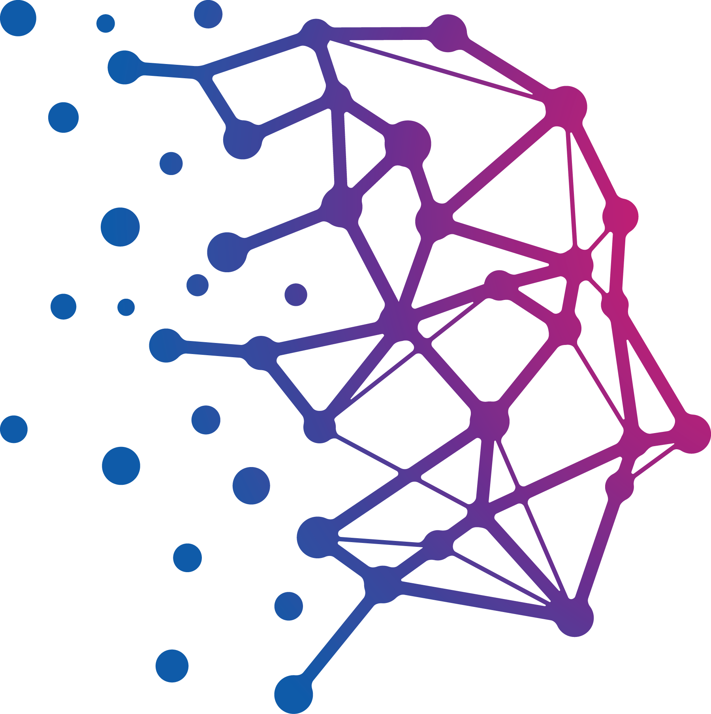

# Core Faculty

<table>
  <tr>
    <td></td>
    <td></td>
    <td></td>
  </tr>
  <tr>
     <th><a href="https://timalthoff.de/"><b>Tim Althoff</b></a></th>
     <th><a href="https://homes.cs.washington.edu/~leibatt/bio.html"><b>Leilani Battle</b></a></th>
     <th><a href="https://ajratner.github.io/"><b>Alex Ratner</b></a></th>
  </tr>
 </table>

# Collaborating Faculty

<table>
  <tr>
    <td></td>
    <td></td>
    <td></td>
  </tr>
  <tr>
     <th><a href="https://www.cs.washington.edu/people/faculty/magda"><b>Magdalena Balazinska</b></a></th>
     <th><a href="https://homes.cs.washington.edu/~jheer/"><b>Jeff Heer</b></a></th>
     <th><a href="https://homes.cs.washington.edu/~suciu/"><b>Dan Sucio</b></a></th>
  </tr>
 </table>

# Students

## [Ken Gu](https://kenqgu.com/)

## [Inna Lin](https://innawy.github.io/)

## [Margaret Li](https://margs.li/)

## [Mike Merrill](https://mikemerrill.io/)

## [Ashish Sharma](https://ash-shar.github.io/)

## [Jina Suh](https://www.microsoft.com/en-us/research/people/jinsuh/)

## [Galen Weld](https://galenweld.com/overview)

## [Melih Yilmaz](https://github.com/melihyilmaz)

# Affiliated Labs

<table>
  <tr>
    <td></td>
    <td><a href="https://bdata.cs.washington.edu/"><b>UW Behavioral Data Science Lab</b></a></td>
  </tr>
    <tr>
    <td></td>
    <td><a href="https://realitylab.uw.edu/"><b>UW Reality Lab</b></a></td>
  </tr>
    <tr>
    <td></td>
    <td><a href="https://db.cs.washington.edu/"><b>UW Databases Group</b></a></td>
  </tr>
    <tr>
    <td>IDL Placeholder</td>
    <td><a href="https://idl.cs.washington.edu/"><b>UW Interactive Data Lab</b></a></td>
  </tr>
</table>

### [bdata lab](https://bdata.cs.washington.edu/)

### [UW Reality Lab](https://realitylab.uw.edu/)

### [UW Databases Group](https://db.cs.washington.edu/)

### [UW Interactive Data Lab](https://idl.cs.washington.edu/)