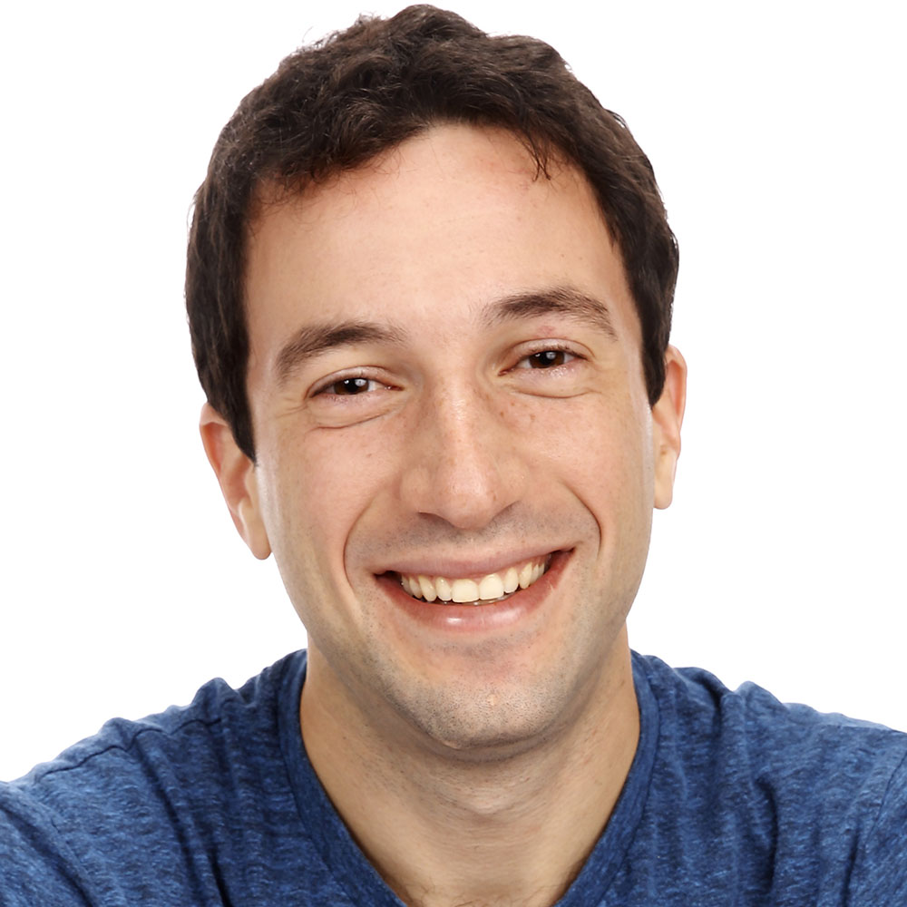
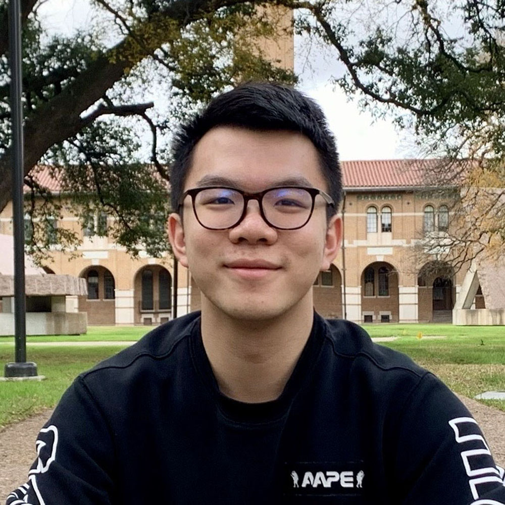
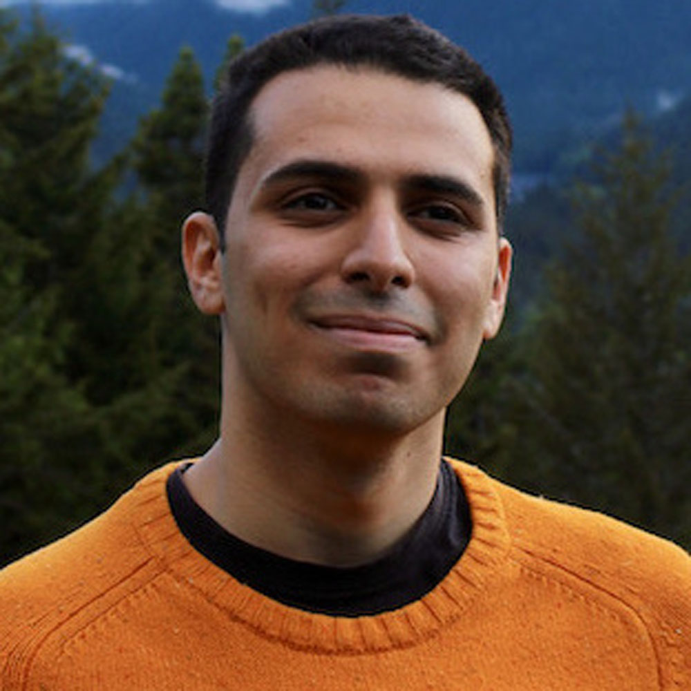

# Core Faculty

<table>
  <tr>
    <td></td>
    <td></td>
    <td></td>
  </tr>
  <tr>
     <th><a href="https://timalthoff.de/"><b>Tim Althoff</b></a></th>
     <th><a href="https://homes.cs.washington.edu/~leibatt/bio.html"><b>Leilani Battle</b></a></th>
     <th><a href="https://ajratner.github.io/"><b>Alex Ratner</b></a></th>
  </tr>
 </table>

# Collaborating Faculty

<table>
  <tr>
    <td></td>
    <td></td>
    <td></td>
  </tr>
  <tr>
     <th><a href="https://www.cs.washington.edu/people/faculty/magda"><b>Magda Balazinska</b></a></th>
     <th><a href="https://homes.cs.washington.edu/~jheer/"><b>Jeff Heer</b></a></th>
     <th><a href="https://homes.cs.washington.edu/~suciu/"><b>Dan Suciu</b></a></th>
  </tr>
 </table>

# Students

<table>
  <tr>
    <td></td>
    <td></td>
    <td></td>
  </tr>
  <tr>
     <th><a href="https://homes.cs.washington.edu/~mdaum/"><b>Maureen Daum</b></a></th>
     <th><a href="https://madeleinegrunde.github.io/"><b>Madeleine Grunde-McLaughlin</b></a></th>
     <th><a href="https://kenqgu.com/"><b>Ken Gu</b></a></th>
  </tr>
  <tr>
    <td></td>
    <td></td>
    <td></td>
  </tr>
  <tr>
     <th><a href="https://dongheuw.github.io/"><b>Dong He</b></a></th>
     <th><a href="https://chengyuhsieh.github.io/"><b>Cheng-Yu Hsieh</b></a></th>
     <th><a href="http://students.washington.edu/kalea/"><b>Alex Kale</b></a></th>
  </tr>
  <tr>
    <td></td>
    <td></td>
    <td></td>
  </tr>
  <tr>
     <th><a href="https://kayali.io"><b>Moe Kayali</b></a></th>
     <th><a href="https://margs.li/"><b>Margaret Li</b></a></th>
     <th><a href="https://innawy.github.io/"><b>Inna Wanyin Lin</b></a></th>
  </tr>
  <tr>
    <td></td>
    <td></td>
    <td></td>
  </tr>
  <tr>
     <th><a href="https://antonlykov.com"><b>Anton Lykov</b></a></th>
     <th><a href="https://mikemerrill.io/"><b>Mike Merril</b></a></th>
     <th><a href="https://ameyabp.github.io/"><b>Ameya Patil</b></a></th>
  </tr>
  <tr>
    <td></td>
    <td></td>
    <td></td>
  </tr>
  <tr>
     <th><a href="https://ash-shar.github.io/"><b>Ashish Sharma</b></a></th>
     <th><a href="https://luke-s-snyder.github.io/"><b>Luke Snyder</b></a></th>
     <th><a href="https://www.jinasuh.com/"><b>Jina Suh</b></a></th>
  </tr>
  <tr>
    <td></td>
    <td></td>
    <td></td>
  </tr>
  <tr>
     <th><a href="https://galenweld.com/overview"><b>Galen Weld</b></a></th>
     <th><a href="https://homes.cs.washington.edu/~wtshuang/"><b>Sherry Tongshuang Wu</b></a></th>
     <th><a href=""><b>Junran Yang</b></a></th>
  </tr>
  <tr>
    <td></td>
    <td></td>
    <td></td>
  </tr>
  <tr>
     <th><a href="https://zhang-eh.github.io/"><b>Enhao Zhang</b></a></th>
     <th><a href="https://jieyuz2.github.io/"><b>Jieyu Zhang</b></a></th>
     <th><a href=""><b></b></a></th>
  </tr>
 </table>

# Affiliated Labs

<table>
  <tr>
    <td></td>
    <td><a href="https://bdata.cs.washington.edu/"><b>UW Behavioral Data Science Lab</b></a></td>
  </tr>
    <tr>
    <td></td>
    <td><a href="https://realitylab.uw.edu/"><b>UW Reality Lab</b></a></td>
  </tr>
    <tr>
    <td></td>
    <td><a href="https://db.cs.washington.edu/"><b>UW Databases Group</b></a></td>
  </tr>
    <tr>
    <td>IDL Placeholder</td>
    <td><a href="https://idl.cs.washington.edu/"><b>UW Interactive Data Lab</b></a></td>
  </tr>
</table>
